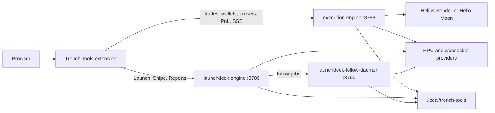
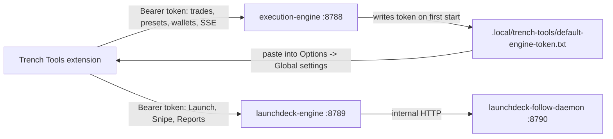

# Architecture

Trench Tools is local-first. The browser talks to local Rust hosts, those hosts use your configured RPC/provider accounts, and your private keys stay on the machine or VPS running the stack.

## The Three Pieces

- `execution engine` (`execution-engine`, port `8788`) - local Rust trading host. Owns wallets, presets, fee/route resolution, transaction build/sign/send, confirmations, PnL, local ledger, event stream, and the voluntary Trench Tools fee setting.
- `Trench Tools extension` - Chrome/Edge extension. Injects into supported terminals and sends trade requests to the execution engine. It also embeds LaunchDeck when the LaunchDeck host is running.
- `LaunchDeck` (`launchdeck-engine`, port `8789`, plus `launchdeck-follow-daemon`, port `8790`) - launchpad feature. Owns deploy, snipe, dev-buy, dev-sell, follow, launch reports, and launchpad-specific UI routes.

## Process Map



## Auth Flow

Both browser-facing hosts use the same shared bearer token.



The extension can probe:

```text
http://127.0.0.1:8788/api/extension/auth/bootstrap
```

That bootstrap route is unauthenticated and tells the extension where the default token file lives. Other extension routes require the bearer token.

## execution-engine Responsibilities

The execution engine owns the trade path:

- wallet loading from `SOLANA_PRIVATE_KEY*`
- execution-engine presets
- wallet groups used by extension trading
- quote/route/fee resolution
- transaction build/sign/send for supported trade families
- confirmation handling
- local trade ledger and batch history
- SSE balance/PnL/event stream
- voluntary Trench Tools fee behavior
- extension runtime status

Anything that submits an extension trade goes through this host.

## Extension Responsibilities

The extension owns browser integration:

- site injection
- terminal-specific DOM adapters
- floating launcher / panel / popout surfaces
- Options page
- preset editing
- wallet group editing
- host/token connection settings
- forwarding trade requests to `execution-engine`
- forwarding LaunchDeck surfaces to `launchdeck-engine`

Terminal adapters are the only place that should scrape site DOM. Panel/background code should consume normalized data from adapters.

## LaunchDeck Responsibilities

LaunchDeck owns launchpad workflows:

- deploy/build/simulate/send flows
- launchpad-specific settings and presets
- snipe workflows
- dev buy / dev sell
- follow jobs and follow sells
- launch reports and local history
- metadata/image workflows

LaunchDeck can run standalone at:

```text
http://127.0.0.1:8789
```

The extension popout can also show LaunchDeck when `launchdeck-engine` is running.

## Follow Daemon Responsibilities

The follow daemon is separate so delayed/follow work does not depend on one browser request staying open.

It owns:

- delayed sniper buys
- confirmed-block/offset actions
- dev-auto-sell jobs
- follow sells
- watcher health
- persisted follow job state

It normally stays behind `launchdeck-engine`.

## Local State

The launcher points runtime state at:

```text
.local/trench-tools
```

Important files:

- `.local/trench-tools/default-engine-token.txt` - shared bearer token
- `.local/trench-tools/engine-runtime.json` - runtime settings/state
- `.local/trench-tools/follow-daemon-state.json` - follow daemon state
- `.local/trench-tools/launchdeck-pending-ledger.jsonl` - pending LaunchDeck ledger records when execution engine is offline

Logs default to:

```text
.local/logs
```

These paths are local operator state. Do not commit them.

## Runtime Modes

- `ee` - starts only `execution-engine`; extension trading and PnL work.
- `ld` - starts `launchdeck-engine` and `launchdeck-follow-daemon`; standalone LaunchDeck works.
- `both` - starts all three; normal full setup.

LaunchDeck can queue confirmed trade records locally when `execution-engine` is unavailable and replay them into the execution ledger once the execution host comes back.

## Provider Boundary

The provider is only the send path. The stack also has separate RPC and websocket paths.

- Send provider: `Helius Sender` or `Hello Moon`
- Read/confirm RPC: `SOLANA_RPC_URL`
- Watcher websocket: `SOLANA_WS_URL`
- Warm/cache/block-height RPC: `WARM_RPC_URL`

This split keeps low-latency sends separate from general reads, watchers, and warm probes.

## Security Boundary

The default boundary is your machine or VPS:

- local hosts bind to loopback by default
- browser-facing routes require the shared bearer token
- private keys live in `.env`
- runtime state lives under `.local/trench-tools`
- raw ports should not be exposed publicly

For remote access, prefer SSH tunnels. If you intentionally expose a host for extension use, use HTTPS and browser host-permission grants. See [../SECURITY.md](../SECURITY.md).
