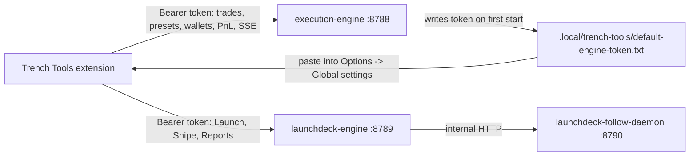

# Trench Tools Extension

The Trench Tools extension is the browser surface for the execution engine. It injects trading controls into supported terminals, reads your local presets and wallet groups, and sends trades through your local `execution-engine`.

When `LaunchDeck` is running too, the extension also gives you an embedded LaunchDeck popout for launch, snipe, and reports.

## Quick Setup

1. Set `TRENCH_TOOLS_MODE=both` in `.env`, or leave it blank for the same default.
2. Start the backend from the repo root:

```bash
npm start
```

3. Download the latest packaged extension zip to the PC running Chrome/Edge, unzip it, and load the unzipped `trench-tools-extension` folder as an unpacked extension. You can also pull `extension/trench-tools` or the full repo with git and load that source folder.
4. Load the extension folder as an unpacked Chrome/Edge extension.
5. Open extension Options -> `Global settings`.
6. Set `Execution host` to `http://127.0.0.1:8788`.
7. Set `LaunchDeck host` to `http://127.0.0.1:8789`.
8. Paste the shared token from `.local/trench-tools/default-engine-token.txt`.
9. Save and test both hosts.

For VPS installs, keep the SSH tunnel open first so those local-looking URLs point through to the VPS.

## Supported Sites

Current status:

- Live: `axiom.trade`
- Live: `j7tracker.io`
- Coming soon: Terminal (formerly Padre), GMGN, Telegram web, Discord web, X, and many more platforms

Axiom currently includes token-page instant trade, Pulse quick buy, Pulse manual panel, watchlist quick buy, wallet-tracker quick buy, floating launcher, embedded LaunchDeck popout, Pulse/Token Vamp helpers, and DexScreener shortcuts.

J7 includes contract-address quick actions, tweet-card Deploy/Vamp buttons, LaunchDeck context handoff, and configurable after-deploy behavior.

The foundation is ready. Adding more terminals, trackers, and web apps should be incremental rather than a rewrite.

## Toolbar Popup

The toolbar popup is the quickest place to check the local host and change the active trade selection.

When connected, it shows:

- host status and engine version
- number of loaded presets, wallets, and wallet groups
- quick-buy amount
- active execution preset
- active wallet group or selected wallets
- `Open app` for the Options/app surface
- `Disconnect` to clear the saved token from the extension

If no auth token is saved, the popup shows a token gate. Paste the value from `.local/trench-tools/default-engine-token.txt`, then connect. The popup stores the same shared token used by the Options page.

The popup, floating panel, and Axiom inline controls share the same quick-trade preferences. Changing the active preset, wallets, or quick-buy amount in the popup updates what the panel and inline buttons use.

## Axiom Surfaces

Axiom is the live production site integration today. Depending on which toggles are enabled in Options -> `Sites`, Trench Tools can show:

- token-page instant-trade controls
- floating token panel
- Pulse quick-buy buttons
- Pulse manual panel buttons
- Pulse LaunchDeck toolbar entry
- Pulse and token-page Vamp import helpers
- Pulse and token-page DexScreener shortcuts
- watchlist quick-buy buttons
- wallet-tracker quick-buy buttons
- embedded LaunchDeck popout

The token-page instant panel can show Axiom controls, Trench Tools controls, or both. The extension remembers the panel's position/size where supported and mirrors the active preset and wallet selection into the Trench Tools controls.

Pair addresses from Axiom are treated as route hints, not blind execution authority. When a pair is available, the extension sends it so the engine can classify the route directly from RPC owner/layout checks. If the engine cannot verify the pair as a supported route, it fails with a clear unsupported-pool message.

## J7Tracker Surfaces

J7 support is live on `j7tracker.io`. Depending on which J7 toggles are enabled in Options -> `Sites`, Trench Tools can show:

- quick-buy, manual-panel, and Vamp buttons after detected Solana contract addresses
- LaunchDeck Deploy and Vamp buttons on tweet cards
- optional hiding of J7's native Deploy/Vamp buttons when Trench Tools buttons are shown
- after-deploy behavior controls, including toast-only and Axiom open-tab/open-window actions

LaunchDeck deploys opened from J7 can carry tweet context into the launch form. When images are detected from that context, LaunchDeck can offer image candidates that can be selected, cropped, or saved to the local image library.

## Which Backend Mode?

Set `TRENCH_TOOLS_MODE` in `.env`, then use `npm start`.

- `TRENCH_TOOLS_MODE=ee`: extension trading, wallets, presets, balance/PnL surfaces work. Launch/Snipe/Reports in the popout show offline until LaunchDeck is running.
- `TRENCH_TOOLS_MODE=both` or blank: normal full setup. Extension trading plus LaunchDeck popout all work.
- `TRENCH_TOOLS_MODE=ld`: standalone LaunchDeck only. Not enough for extension quick-trading by itself.

For normal extension use, run `ee` or `both`. You can still use `trench-tools-start.* --mode ...` for one-off manual overrides.

## Install In Chrome Or Edge

1. Start the backend first:
   - set `TRENCH_TOOLS_MODE=both` in `.env`, or leave it blank for the same default
   - run `npm start` from the repo root
2. Get the extension on the PC that runs Chrome/Edge. The simplest path is the latest packaged zip: `trench-tools-extension.zip` from the `extension-latest` GitHub release.
3. Unzip it and keep the unzipped `trench-tools-extension` folder somewhere stable, such as `Documents\Trench Tools Extension`.
4. Open Chrome or Edge.
5. Open `chrome://extensions` or `edge://extensions`.
6. Enable `Developer mode`.
7. Click `Load unpacked`.
8. Select the unzipped `trench-tools-extension` folder.
9. Open the Trench Tools extension Options page.

If you only need quick trading and PnL, set `TRENCH_TOOLS_MODE=ee`. If you want LaunchDeck in the popout, use `TRENCH_TOOLS_MODE=both` or leave it blank.

Packaged release path:

```text
https://github.com/0xD3bt/Execution-engine/releases/tag/extension-latest
```

Download `trench-tools-extension.zip`, unzip it, and load the unzipped `trench-tools-extension` folder. Chrome/Edge cannot load the zip directly.

If you already cloned the full repository, you can load this source folder instead:

```text
extension/trench-tools
```

To pull only the extension folder from git:

```bash
git clone --depth 1 --filter=blob:none --sparse https://github.com/0xD3bt/Execution-engine.git trench-tools-extension-source
cd trench-tools-extension-source
git sparse-checkout set extension/trench-tools
```

Then load this folder in Chrome/Edge:

```text
trench-tools-extension-source/extension/trench-tools
```

To update that fallback copy later:

```bash
cd trench-tools-extension-source
git pull --ff-only
```

If you use the packaged zip, update by downloading the newest `trench-tools-extension.zip`, replacing the old unzipped folder, then clicking reload for Trench Tools on `chrome://extensions` or `edge://extensions`.

## Connect The Extension

Open Options -> `Global settings`.

Primary connection:

- `Execution host` should be `http://127.0.0.1:8788`
- `Shared access token` should contain the token from `.local/trench-tools/default-engine-token.txt`
- click `Save token`
- click `Test execution host`

LaunchDeck host:

- `LaunchDeck host` should be `http://127.0.0.1:8789`
- it reuses the same shared token
- click `Test LaunchDeck connection` if you are running `both` or `ld`

Those host fields are currently locked to local hosts in the Options UI. Remote host notes are below for future/custom setups.

## How It Fits Together

- `execution-engine` on `http://127.0.0.1:8788` handles trading, wallets, presets, PnL, batch execution, and the live event stream.
- `launchdeck-engine` on `http://127.0.0.1:8789` handles the embedded LaunchDeck shell: Launch, Snipe, Reports, and launchpad routes.
- `launchdeck-follow-daemon` on `http://127.0.0.1:8790` sits behind LaunchDeck and owns delayed/follow actions.
- The extension authenticates to both exposed hosts with the same shared access token from `.local/trench-tools/default-engine-token.txt`.



### VPS Browser Tunnel

If Trench Tools runs on a VPS and Chrome/Edge runs on your own computer, `127.0.0.1` in the extension means your computer, not the VPS. Use SSH forwards so the browser can reach the private VPS services through local loopback. The VPS path is the recommended real trading setup: it can take about 5 minutes with the bootstrap script, keeps the services private, and gives better performance by placing the runtime near RPC/provider endpoints.

The SSH key is created on your computer and the public key is selected in the VPS provider's deploy settings. The private key stays on your computer. That same SSH setup is used for login, Cursor Remote SSH, and the browser tunnel. See [VPS_SETUP.md](VPS_SETUP.md) for the full first-time flow.

Recommended SSH config on your local machine:

```sshconfig
Host Trenchtools-vps
  HostName YOUR_SERVER_IP
  User root
  IdentityFile ~/.ssh/id_ed25519
  IdentitiesOnly yes
  LocalForward 8788 127.0.0.1:8788
  LocalForward 8789 127.0.0.1:8789
  ExitOnForwardFailure yes
  ServerAliveInterval 30
```

Connect with:

```bash
ssh Trenchtools-vps
```

Keep that SSH session open while using the extension.

Manual fallback:

```bash
ssh -L 8788:127.0.0.1:8788 -L 8789:127.0.0.1:8789 root@YOUR_SERVER_IP
```

`8788` is for execution trades, execution presets, wallets, and PnL. `8789` is for LaunchDeck UI, LaunchDeck presets, and reports. If execution works but LaunchDeck connection testing fails, check that local port `8789` is forwarded.

When the tunnel is open, keep these Options values:

- `Execution host` -> `http://127.0.0.1:8788`
- `LaunchDeck host` -> `http://127.0.0.1:8789`
- `Shared access token` -> token from the VPS file path below

## Find The Auth Token

The default token file is:

```text
.local/trench-tools/default-engine-token.txt
```

On a VPS installed to the default path:

```text
/opt/launchdeck/.local/trench-tools/default-engine-token.txt
```

The execution engine also exposes an unauthenticated bootstrap probe at:

```text
http://127.0.0.1:8788/api/extension/auth/bootstrap
```

That endpoint tells the extension where the default token file lives. Other extension routes are bearer-protected.

If you rotate or replace the token while a page is open, reload the extension page/site after saving the new token.

## Presets

Open Options -> `Presets`.

There are two preset groups:

- `Execution Engine Presets` drive the extension quick-trade panel and multi-wallet execution flow.
- `LaunchDeck Presets` stay on the LaunchDeck config path and are also editable inside the LaunchDeck settings modal.

For a basic execution-engine preset:

1. Click `Add engine preset`.
2. Set buy amounts and sell percentages.
3. Pick the provider you want to test first (`Helius Sender` or `Hello Moon`).
4. Set slippage, fee/tip behavior, and Auto Fee settings.
5. Save.

For LaunchDeck presets:

1. Click `Add LaunchDeck preset`.
2. Set creation, buy, and sell provider defaults.
3. Set launch/snipe amounts and sell percentages.
4. Save.

The panel needs at least one usable execution preset and at least one selected wallet or wallet group before it can submit trades.

LaunchDeck's launch form also has token name preset buttons. These are separate from execution presets: they apply saved name/ticker prefixes and suffixes to the current launch form so repeated naming patterns are faster to enter.

## Wallets And Wallet Groups

Open Options -> `Wallets`.

Use this page to:

- confirm wallets loaded from `SOLANA_PRIVATE_KEY*`
- choose active wallets
- create wallet groups
- decide how buy amounts are distributed across wallets

Keep real private keys in `.env`. Do not paste them into docs, screenshots, support messages, or public issues.

## Live PnL And Coin Actions

The panel keeps live balance/PnL state for the active token while the execution engine is reachable. The coin-actions menu can:

- toggle gross/net PnL display
- resync the current coin from local execution history
- reset local PnL for the current coin
- open global settings
- hide or show the compact preset and wallet-group rows

Resync/reset only affect local Trench Tools PnL/history state. They do not change on-chain balances.

## Token Split And Consolidate

The wallet button in the panel opens wallet selection for the current token. Where the current token and wallets support it:

- `Split Tokens` redistributes token balance across selected wallets.
- `Consolidate` moves selected token balances into one destination wallet.

Token distribution uses the selected execution preset for provider/fee behavior. It currently supports the recommended extension providers: `Helius Sender` and `Hello Moon`. It does not support every token program variant; Token-2022 transfer-hook mints are rejected for distribution.

For split actions, select at least two wallets and at least one holder wallet. For consolidate, select exactly one destination wallet. Start with small balances until you are comfortable with the flow.

## Latency And Prewarm

The extension and engine use best-effort prewarm on user intent, such as opening a manual panel or hovering/clicking a supported control. Prewarm can reduce first-click work, but it is not required for correctness. The engine still verifies the route and current account state before building a trade.

If a warm route is stale, unsupported, or invalidated after a trade, the next action can fall back to a fresh route plan. Logs may show route metrics and warm-cache status while this happens.

## Sites Tab

Open Options -> `Sites`.

Use the per-site toggles to customize where Trench Tools is active. Axiom has separate toggles for trading buttons, panels, Vamp/DexScreener helpers, and LaunchDeck-related injection. J7 has separate toggles for contract-address quick actions, tweet-card Deploy/Vamp buttons, optional native-button hiding, and after-deploy behavior.

Future platforms such as Terminal, GMGN, Telegram web, Discord web, X, and others will appear here as they ship.

## Voluntary Fee

Open Options -> `Global settings` -> `Voluntary fee`.

The default tier is `0.1%` (`10` bps). It can be turned off or increased:

- `0% (no fee)` = off
- `0.1%` = default
- `0.2%` = increased support

The same default can be set in `.env`:

```bash
TRENCH_TOOL_FEE=0    # off
TRENCH_TOOL_FEE=0.1  # default
TRENCH_TOOL_FEE=0.2  # increased support
```

If Trench Tools has saved you money and time and you want to support development and future tools, consider leaving the default `0.1%` fee enabled.

## Updating Later

After pulling a new repo version:

1. Stop the runtime.
2. Run `git pull --ff-only`.
3. Run `npm install` if dependencies changed.
4. Start the runtime again.
5. Open `chrome://extensions` or `edge://extensions`.
6. Click reload on the unpacked Trench Tools extension.
7. Open Options -> `Global settings` and test the execution host and LaunchDeck host again.

If you installed from the packaged zip instead of a git checkout, download the latest `trench-tools-extension.zip` from the `extension-latest` release, unzip it over or beside the old extension folder, then reload the unpacked extension in Chrome/Edge.

Upgrade the extension and local binaries together when a release changes host routes or auth behavior.

## Remote Hosts

Loopback (`127.0.0.1`) is the normal setup. If you intentionally point the extension at a non-loopback host:

- use HTTPS
- do not expose raw HTTP ports publicly
- grant the required browser host permission when prompted
- use the same shared bearer token for both hosts
- prefer an SSH tunnel for VPS use unless you are intentionally managing your own reverse proxy and access controls

See [VPS_SETUP.md](VPS_SETUP.md) and [SECURITY.md](../SECURITY.md).

## Day-one Checklist

- `execution-engine` is reachable at `http://127.0.0.1:8788`.
- `launchdeck-engine` is reachable at `http://127.0.0.1:8789` if you want Launch/Snipe/Reports.
- Options -> Global settings has the shared token saved.
- At least one execution preset exists.
- At least one wallet group exists.
- Site toggles match where you want the extension active.
- First real action uses a small test amount.

## Troubleshooting

Common fixes:

- If Options says the execution host is unreachable, make sure `.env` has `TRENCH_TOOLS_MODE=ee`, `TRENCH_TOOLS_MODE=both`, or blank, then run `npm start`.
- If LaunchDeck popout is offline, use `TRENCH_TOOLS_MODE=both` or `TRENCH_TOOLS_MODE=ld`, then verify local port `8789` is forwarded when using a VPS.
- If auth fails, paste the contents of `.local/trench-tools/default-engine-token.txt` into `Shared access token` and save again.
- If a supported site does not show Trench Tools, reload the unpacked extension and refresh the site.

For more, see [TROUBLESHOOTING.md](TROUBLESHOOTING.md).
